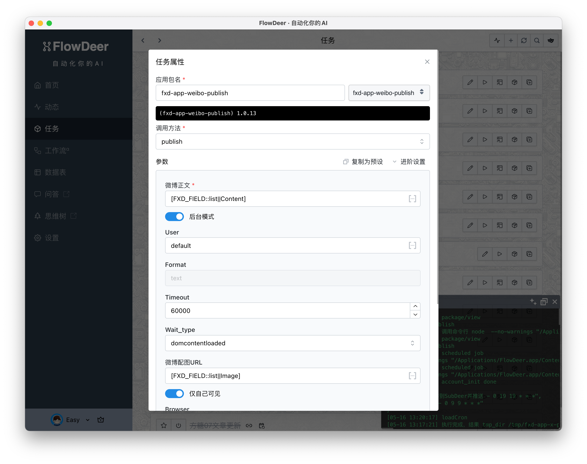

# What is Fxd

[ [中文](./README.zh-cn.md) | [English](./README.md) ]


Fxd stands for Flow eXtension Define, a specification designed for extending workflows, especially AI and automation workflows.

[FXD Official Manual](https://ft07.com/fxd/)

For example, if you need to monitor the latest articles from an RSS feed, translate them into Chinese, add images, and post them to your X platform, this task is not difficult for AI. However, due to the many steps involved, few tools can automate the entire process.

Using Fxd, we would first encapsulate the following Fxd Apps:

-   RSS Monitoring App
-   GPTChat App
-   DALL-E App
-   X Posting App

Each of these is an independent NPM package, and each app can be called via the command line using Fxd-Cli. This way, we only need to use Shell or other scripts to combine these Fxd Apps, flexibly achieving various functions. For example, if you want to post to Weibo instead of X, you only need to replace the last app.

An example of posting to Weibo:

```bash
fxd weiboLive auth # Initial posting requires logging in through the browser, no need to manually log in each time
fxd weiboPublish --content="Hello there" --self_only="true" --format="json" --headless="false"
```

It can also be used directly in clients that comply with the FXD specification, such as the FlowDeer client.



# Development Environment

## Command Line Debugging

This repo uses Yarn workspaces to manage multiple packages. Run in the root directory:

```bash
yarn install
```
<details>
<summary>Solution for Windows error "cannot load file **Roaming\npm\yarn.ps1"</summary>
This error is caused by policy restrictions. Please follow these steps to resolve it:

1. Search for PowerShell, right-click to run as administrator
1. Enter `Set-ExecutionPolicy RemoteSigned` and choose Y
1. Close PowerShell and rerun the yarn command
</details>

Then navigate to the command line directory
```bash
cd packages/fxd-cli
```

On Unix-like systems, use `./fxd` in the directory as the command line tool:

```bash
# View help
./fxd core help

# View Demo app help
./fxd demo help
```
On Windows, manually add the node command prefix

```bash
# View help
node fxd core help

# View Demo app help
node fxd demo help
```

## FXD App Code Generation

You can create a copy of the `fxd-app-demo` for modification and debugging. Once completed, publish it using `npm publish fxd-app-your-app` to make it available on all software supporting the FXD specification.

Starting from May 21, 2024, code generation for initializing an FXD app is introduced. The usage is as follows:

Configure environment variables:

- `DEFAULT_AI_CHAT_KEY`: openai/api2d key
- `DEFAULT_AI_CHAT_BASEURL`: `https://api.openai.com` or `https://oa.api2d.net`

In the `fxd-cli` directory, run:

```bash
./fxd codegen
```

https://github.com/easychen/fxd/assets/1294760/c6f995f8-b5ae-4db4-9265-8d6ebb4b781c

Follow the prompts to complete the process.

## Debugging in FlowDeer

By default, FlowDeer installs packages from the NPM site directly; however, we may need to debug before publishing. Here is a solution:

Since FlowDeer prioritizes local directories, we can run `npm install <package-path>` in the corresponding FlowDeer directory via the command line for local installation.

Specifically, for Mac systems:

```bash
cd /Applications/FlowDeer.app/Contents/Resources/app.asar.unpacked/src/local-api
npm install path/to/your/package
```

If you haven't installed FlowDeer in the Applications directory, please adjust the `/Applications/FlowDeer.app` part of the path accordingly.

For Windows systems:

```bash
cd <FlowDeer-directory>/resources/app.asar.unpacked/src/local-api
npm install path/to/your/package
```

After installation, simply add the package name in the FlowDeer interface.

# License

The SDK, command line tools, and core packages of FXD are by default licensed under the PolyForm Noncommercial License. If the packages directory contains different licenses, the latter prevails.

Any code contributed to this project is considered authorized for commercial use by the project authors and their affiliated companies and distributed under this project's license (PolyForm Noncommercial License).

The PolyForm Noncommercial License allows you to modify this project and distribute it for any non-commercial purposes. During distribution, you must ensure that the recipients receive a copy of the license and are aware that the copyright belongs to "Sugar Balloons". For more detailed instructions, please read the license document.

Applications based on FXD (similar to fxd-app-demo) can be licensed as you see fit, but distribution must still comply with the agreement. For example:

1. If you create fxd-app-demo and license it under the MIT license, you can handle the fxd-app-demo code as you wish.
2. If you guide users to install and use fxd-app-demo via fxd-cli, you do not need to comply with this project's license.
3. If you bundle fxd-cli and fxd-sdk code as a product for distribution, then you must comply with this project's license.