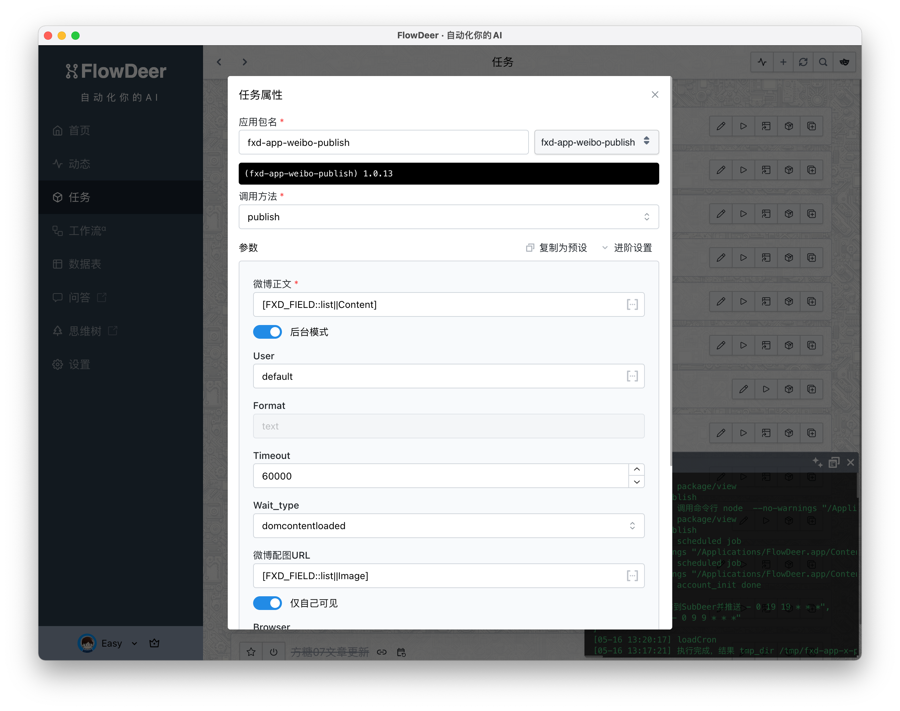

# Fxd是什么


[ [中文](./README.zh-cn.md) | [English](./README.md) ]


Fxd 是 Flow eXtension Define 的缩写，它是一个被设计用于工作流（尤其是AI和自动化工作流）扩展的规范。

[FXD官方手册](https://ft07.com/fxd/)

比如说，你需要从RSS中监测最新文章，然后翻译为中文，并为其配图后，发布到自己的X上边。这个任务对AI来讲并不困难，但因为环节较多，很少有工具可以自动化完成。

按Fxd的做法，我们会首先封装以下几个Fxd App：

-   RSS监测 App
-   GPTChat APP
-   DALL-E APP
-   X发布APP

其中每一个都是独立的 NPM Package，而且每一个 APP 都可以通过 Fxd-Cli 在命令行下调用。这样，我们只需要用 Shell 或者其他脚本，将这些 Fxd App 组合起来，就可以灵活地实现各种功能。比如你不想发布到X了，改为发布到微博。那么只需要将最后一个APP 换掉。

一个发布微博的例子：

```bash
fxd weiboLive auth # 首次发布时需要在启动的浏览器中登录，不用每次都手动登录 
fxd weiboPublish --content="你好呀" --self_only="true" --format="json" --headless="false"
```

也可以在遵循 FXD 规范的客户端，比如 FlowDeer 客户端中直接使用。



# 开发环境


## 命令行调试

本 Repo 采用了 Yarn workspaces 来管理多个包。在根目录下运行：

```bash
yarn install
```
<details>
<summary>Windows 无法加载文件 **Roaming\npm\yarn.ps1 的解决方案</summary>
这是因为策略限制导致的错误，请按以下步骤解决：

1. 搜索Powershell，右键以管理员身份运行
1. 输入 Set-ExecutionPolicy RemoteSigned 然后选 Y
1. 关闭PowerShell，重新运行 yarn 命令
</details>


然后进入命令行的目录
```bash
cd packages/fxd-cli
```

类Unix系统上，将目录下的 ./fxd 作为命令行工具使用即可：

```bash
# 查看帮助
./fxd core help

# 查看Demo应用帮助
./fxd demo help
```
Windows上需要手工添加 node 命令前缀

```bash
# 查看帮助
node fxd core help

# 查看Demo应用帮助
node fxd demo help
```

你可以为 `fxd-app-demo` 创建副本进行修改调试，完成后，`npm publish fxd-app-your-app` 发布即可在所有支持FXD规范的软件中使用。

## 在FlowDeer中调试

默认情况下，FlowDeer直接安装 NPM 网站上的包；但我们有需要在发布前调试。这里提供一种解决方案：

由于FlowDeer会优先在本地目录查找，因此我们可以通过命令行在 FlowDeer 对应的目录下运行 npm install <package-path> 进行本地安装。

具体而言，对于Mac系统：

```bash
cd /Applications/FlowDeer.app/Contents/Resources/app.asar.unpacked/src/local-api
npm install path/to/your/package
```

如果你没有将 FlowDeer 安装在 Application 目录，请自行调整 /Applications/FlowDeer.app 部分路径。

对于Windows系统：

```bash
cd <FlowDeer目录>/resources/app.asar.unpacked/src/local-api
npm install path/to/your/package
```

安装完成后，再在 FlowDeer 界面添加包名即可。

# License

FXD 的SDK、命令行工具和核心包默认采用 PolyForm Noncommercial License,如 packages 目录下包含不同的 License，则以后者为准。

任何贡献到本项目的代码，均视为授权项目作者及其名下公司用于商业用途、并按本项目协议（PolyForm Noncommercial License）分发。

PolyForm Noncommercial License 允许您对本项目进行修改，并用于任何非商业目的分发。分发过程中，需要确保使用人获得授权协议副本，并知晓版权归属于「方糖气球」。更详细的说明请阅读授权文件。

您创建的基于 FXD 的应用（类似 fxd-app-demo ）由您自行决定授权，但分发时仍需遵守协议。举例而言：

1. 如果您创建了 fxd-app-demo 并以 MIT 协议授权，您可以按自定协议随意处理 fxd-app-demo 的代码
2. 如果您引导用户通过 fxd-cli 安装并使用 fxd-app-demo，亦无需遵守本项目的协议
3. 如果您将 fxd-cli 和 fxd-sdk 代码打包为一个产品进行分发，那么则需要遵守本项目的协议